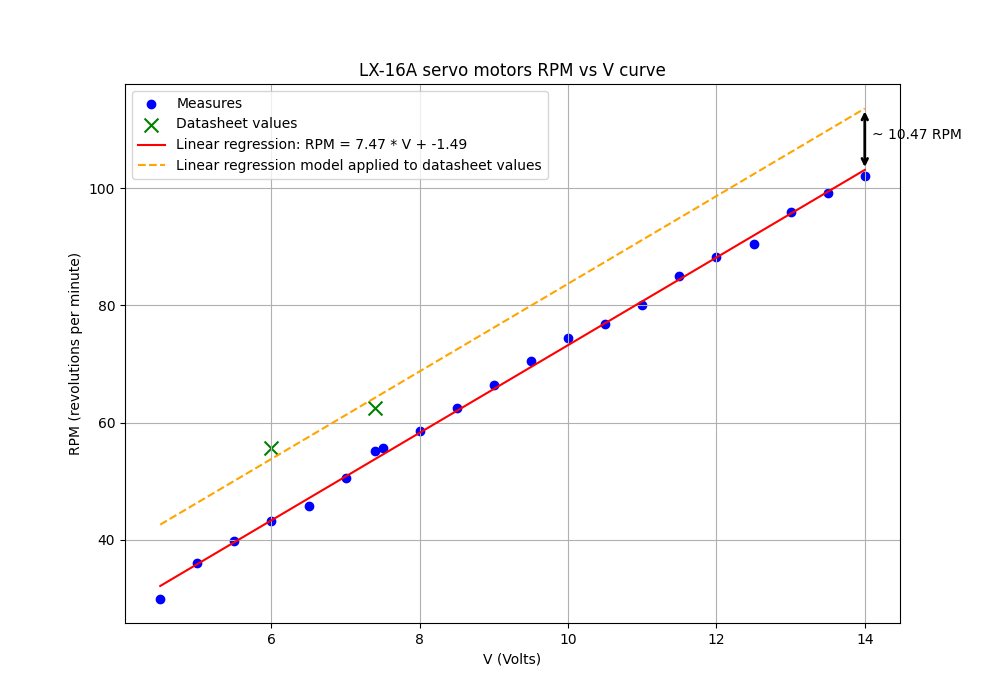

https://github.com/ethanlipson/PyLX-16A/blob/master/documentation.md

# ros2_lx16a_driver

A ROS 2 package designed to interface with the LX-16A servo motors. This package enables control and monitoring of servo motors through ROS 2 services and topics.

## Table of Contents

1. [Features](#features)
2. [Tested Configuration](#tested-configuration)
3. [Package Structure](#package-structure)
   - [Key Components](#key-components)
4. [Installation and Usage](#installation-and-usage)
   - [Prerequisites](#prerequisites)
   - [Installation](#installation)
   - [Running the Node](#running-the-node)
5. [Interfaces](#interfaces)
   - [Topics](#topics)
   - [Services](#services)
   - [Parameters](#parameters)
6. [LX-16A specifications](#lx-16a-specifications)
7. [License](#license)
8. [Acknowledgments](#acknowledgments)


## Features

- Servo parameter configuration (e.g., angle limits, voltage limits, temperature limits).
- Torque enable/disable functionality.
- Position and velocity control.
- Retrieval of servo status and diagnostic information.
- Dynamic discovery of connected servos.

## Tested Configuration

- **ROS 2 Distribution**: Humble
- **Operating System**: Ubuntu 22.04
- **Hardware Interface**: USB connection via BusLinker-V2.5

## Package Structure

```plaintext
ros2_lx16a_driver
├── assets
│   ├── LX-16A_servo_motor_specifications.png
│   └── lx16a_spec.py
├── CMakeLists.txt
├── package.xml
├── params
│   └── lx16a_params.yaml
├── README.md
├── src
│   ├── __init__.py
│   └── lx16a_node.py
└── srv
    ├── GetLX16AInfo.srv
    ├── SetLX16AParams.srv
    └── SetLX16ATorque.srv
```

### Key Components

1. **lx16a_node.py**:
   - Implements the main ROS 2 node (`lx16a_controller`) for managing LX-16A servos.

2. **Service Definitions**:
   - `GetLX16AInfo.srv`: Retrieves detailed information about a specific servo.
   - `SetLX16AParams.srv`: Configures servo parameters.
   - `SetLX16ATorque.srv`: Enables or disables torque for a servo.

3. **Parameter File**:
   - `lx16a_params.yaml`: Defines default parameters such as angle limits, voltage limits, and communication settings.

## Installation and Usage

### Prerequisites

- ROS 2 Humble installed on Ubuntu 22.04.
- Python 3.x with `pylx16a` library.

### Installation

1. Clone the repository into your ROS 2 workspace:
   ```bash
   cd ~/ros2_ws/src
   git clone <repository-url> ros2_lx16a_driver
   ```

2. Install dependencies:
   ```bash
   pip install pylx16a
   ```

3. Build the package:
   ```bash
   cd ~/ros2_ws
   colcon build --packages-select ros2_lx16a_driver
   ```

4. Source the workspace:
   ```bash
   source install/setup.bash
   ```

### Running the Node

1. Connect the LX-16A servo motors to your computer via the BusLinker-V2.5.

2. Launch the node:
   ```bash
   ros2 run ros2_lx16a_driver lx16a_node
   ```

3. Optionally, provide a parameter file:
   ```bash
   ros2 run ros2_lx16a_driver lx16a_node --ros-args --params-file params/lx16a_params.yaml
   ```

## Interfaces

### Topics

- `/cmd_pose_lx16a` (`std_msgs/Float32MultiArray`): Command positions for the servos. (Each command index in the array matches the id of the commanded motor)
- `/cmd_vel_lx16a` (`std_msgs/Int32MultiArray`): Command velocities for the servos. (Each command index in the array matches the id of the commanded motor)

### Services

- `/lx16a_get_info` (`GetLX16AInfo`): Retrieve detailed servo information.
- `/lx16a_set_params` (`SetLX16AParams`): Configure servo parameters.
- `/lx16a_set_torque` (`SetLX16ATorque`): Enable or disable torque for a servo.

### Parameters

- `default_angle_offset` (int): Default angle offset for servos (degrees).
- `default_angle_min` (int): Minimum angle limit (degrees).
- `default_angle_max` (int): Maximum angle limit (degrees).
- `default_voltage_min` (int): Minimum voltage limit (millivolts).
- `default_voltage_max` (int): Maximum voltage limit (millivolts).
- `default_temperature_limit` (int): Maximum temperature limit (Celsius).
- `log_level` (int): Logging verbosity level.
- `port` (str): Serial port for the LX-16A bus.
- `scan_connected_servos` (bool): Automatically scan for connected servos.

## LX-16A specifications:

The servomotor characterization can be found in the assets folder. 

The rotational speed curve as a function of voltage was derived by measuring the motor shaft speed in motor mode, under no-load conditions, with a 100% speed command, using a tachometer for precise measurement.




## License

This package is released under the [BSD 3-Clause License](LICENSE).

## Acknowledgments

This package leverages the [pylx16a](https://github.com/ethanlipson/PyLX-16A/blob/master/documentation.md) library.

